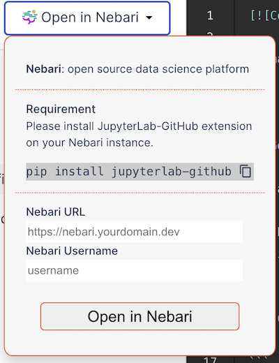

To the readers, I am Aryan Gupta(@[guptaaryan16](https://github.com/guptaaryan16/)), an EE Junior at IIT Roorkee, and this summer, I had a chance to work on PyTorch-Ignite’s Code-Generator Project, a tailor-made web application to help machine learning researchers and enthusiasts and also keeping in mind the growing Kaggle community.

## The Project Itself

Let’s see the project itself. [Code-generator](https://code-generator.pytorch-ignite.ai/) is a [Vue.js](https://vuejs.org/) application that streamlines the process of working on machine learning tasks. The app generates preconfigured code templates for tasks like vision classification, text classification, and other common themes in ML competitions.

The aim is not to be another abstraction over PyTorch and PyTorch-Ignite. Instead, it is a web app that generates the boilerplate code, which means you still have complete control over the generated code. You can start by selecting the minimal template like ‘Text-Classification’ and turn options on or off according to your needs, like a particular logger like [Tensorboard](https://tensorboard.dev/) or an arg-parser like [Python-Fire](https://github.com/google/python-fire/blob/master/docs/guide.md). This app can be helpful in data science competitions on Kaggle or in writing papers, especially with easy integration of loggers and checkpoint handlers. Also, the templates are well-tested on CI and hopefully will require minimal changes to work on your workflows.

This app was created with the great efforts of members of the PyTorch-Ignite community, particularly @[ydcjeff](https://github.com/ydcjeff) @[trsvchn](https://github.com/trsvchn) @[vfdev-5](https://github.com/vfdev-5).

<!--  -->

## The Issues I worked on

My tasks were primarily to work on features that could improve the reproducibility-related features of the templates. Also, I had to contribute to new features and libraries which can be best for experiments configuration management. My contributions to the project were mainly three-fold:

### 1. Working on enhancing templates and existing reproducibility scope of the results from experiments

In this part, I worked on improving the readability of the templates and improving the API of the templates. This led me to make some necessary API changes and test the existing libraries used for writing the research literature in data science and Kaggle competitions. One funny error we caught in the PyYaml project was

```python
#~~ Saving config.yaml for reproducibility
#-------------------------------------
## Config file 1 (config1.yaml)
lr: 1e-10

## Config file 2 (config2.yaml)
lr: 1.0e-10
#-------------------------------------

with open("config1.yaml", "r") as f1:
	config1 = yaml.safe_load(f1) # loads lr -> string
>> config1 = { 'lr': '1e-10' }

with open("config2.yaml", "r") as f2:
  config2 = yaml.safe_load(f2) # loads lr -> python-floating point
>> config2 = { 'lr': 1e-10 } # (the expected behaviour)
```

There were other problems as well, like not being able to store Python objects using `PyYAML API`. This led us to adopt `[OmegaConf.DictConfig](https://omegaconf.readthedocs.io/en/2.3_branch/api_reference.html#the-omegaconf-api)` as the API standard for maintaining config data in the templates. This worked great on testing and is well maintained by the developers. Also, methods like resolution of config dict are very well written in this `OmegaConf` project.

Also, we added support for `[Hydra](http://hydra.cc)` and `[Python-Fire](https://github.com/google/python-fire/blob/master/docs/guide.md)` as they are great in terms of configuration management and also worked very well with PyTorch-Ignite. They also allow overriding existing configurations using the following bash commands.

```bash
[For Python Fire]
>> python main.py config.yaml lr=0.001

[For hydra]
>> python main.py lr=0.001 ++checkpoint_dir=./logs
```

Note that you have to use `++` only for overrides not present in `config.yaml` for the `hydra CLI` use. For more info, do check the docs for [OmegaConf](https://omegaconf.readthedocs.io), [Python-Fire](https://github.com/google/python-fire/blob/master/docs/guide.md) and [Hydra](http://hydra.cc) .

Some of the related PRs can be found here: https://github.com/pytorch-ignite/code-generator/pull/292 https://github.com/pytorch-ignite/code-generator/pull/300 https://github.com/pytorch-ignite/code-generator/pull/302

### 2. Integration with Nebari and other infrastructure management tools

I worked on testing this great infrastructure tool, [Nebari](http://nebari.dev/), which is used for managing GPU clusters and Cloud infrastructure for data scientists and other professionals. It provides a [JupyterHub](https://jupyterhub.readthedocs.io/) interface, which can be very helpful for deploying code and running tools. So, to explain the integration of my project with Nebari, firstly, I would like to discuss how the project stores the templates with a particular configuration.

<center>

</center>

To explain it quickly, let’s see how the app works when you click on `Open in Nebari` . After the button is clicked, we use a `netlify` function to commit a zip file and Jupyter notebook using `github/octokit` to `[PyTorch-Ignite/nbs](https://github.com/pytorch-ignite/nbs)`repository. We can see a committed notebook example below. To understand this better, you can read the code in [PyTorch-Ignite/code-generator/functions/nebari.js](https://github.com/pytorch-ignite/code-generator/tree/main/functions/nebari.js).


Now, to integrate this with the `Nebari` server , we used an extension called [`Jupyterlab-Github`](https://github.com/jupyterlab/jupyterlab-github). I wrote a `netlify` function to create a URL that can use this extension, open the generated link in the new tab, pull the notebook committed by the above `netlify` function, and open this notebook in the server. An example can be seen here. Pretty cool, right?


For this, I appreciate the Jupyter community's extension ecosystem. They have great extensions for everything and maybe in the future, I may work or try to add more extensions to increase the functionality in the app. Also, I would like to thank the Nebari-dev community here, who provided such great support in testing this in the Nebari server.

Some of the related PRs can be found here: https://github.com/pytorch-ignite/code-generator/pull/314 https://github.com/pytorch-ignite/code-generator/pull/265

### 3. The changes in the CI and other Vuejs based parts of the code base (mainly based on JS)

I had to contribute some JavaScript-based code to the app, but since I had not worked on a JS project before, I needed to learn the basics before contributing to these issues, especially [Vue.js](https://vuejs.org) :-( . So, I tried to learn by reading some online tutorials and documentation. I particularly liked this [tutorial](https://www.youtube.com/watch?v=YrxBCBibVo0&list=PL4cUxeGkcC9hYYGbV60Vq3IXYNfDk8At1) series on YouTube.

To explain more about how the generates templates, let's assume I made some files like`main.py`, `model.py`, and `utils.py` as a template. Now we use the `[ejs](https://ejs.co)` project to design the templates. To illustrate this, let us take an example from the templates.

```python
#::: if ((it.argparser == 'fire')) { :::#
    fire.Fire(main)
#::: } else if ((it.argparser == 'hydra')){ :::#
    sys.argv.append("hydra.run.dir=.")
    sys.argv.append("hydra.output_subdir=null")
    sys.argv.append("hydra/job_logging=stdout")
    main()
#::: } else { :::#
    main()
#::: } :::#
```

Now, as you can see, there are some commented codes. This is part of JS, which helps select different configurations of [argparsers.](http://argparsers.It) Seems great, right?

But it can be challenging to manage, and we also need to ensure we satisfy the `lint` formatting for the CI (which can be pretty tricky with templates :-( ). Still, these JS features can be very powerful, and we are trying to improve these as much as possible. By the way, if you are confused about where this `it.argparser` selector came from, better check the project, but the short answer is it comes from a `metadata.json` file that maintains the options for all the templates in the app.

Some of the related PRs can be found here: https://github.com/pytorch-ignite/code-generator/pull/288 https://github.com/pytorch-ignite/code-generator/pull/283

## The Way Forward for the Project

The Code generator project seems to be moving forward at a great pace and is expected to have many more additions in the future. Starting and maintaining a new project is challenging in open source and can have a very high risk/reward ratio. Still, good communities try their best to make and maintain projects that can be helpful for the maximum number of people and reduce the friction for new people entering the community. Some of the issues I suggest and may work on in the future are

### 1. Separate `metadata.json` for each template

We are considering providing separate metadata.json files for each template or something similar to that in the future. I proposed an issue to the project for the same [here](https://github.com/pytorch-ignite/code-generator/issues/308%5C) and will try to work on this in the future.

### 2. Script to contribute new templates

Since it is hard for Data science enthusiasts to learn JS and contribute templates easily, which also seems to be a point of friction in adopting the app, we proposed adding a script that can help make J.S. and CI-related changes to the app as suggested in the issue [here](https://github.com/pytorch-ignite/code-generator/issues/316). This issue may take a bit of hard work, but it can be a great addition to the app.

### 3. More templates and feature options

We will add more templates and feature options in the future to the project. Templates like Object detection, text summarisation, and diffusion models can be an excellent addition to the project.
P.S. If you feel excited about the project, please feel free to suggest more changes and contribute to the project.

# Some Lessons I learnt along the Way

This internship experience increased my confidence in maintaining an open-source codebase and understanding how to test functions and debug changes. It also helped me understand the value of real-life design decisions and CI and how they can significantly influence the project for the good or the bad. Some of the best practices I learned in the open-source projects were:

### 1. Try to make the code changes more Developer centric

When we try to write new code or change the existing files, we often try to do it in a way that adds most features and often forget to write quality code. While working on new changes, try to organize the code better and simplify the common code in a separate `utils` file. This can make the codebase better and more accessible for other developers to view and understand. Also, leave meaningful short comments, as it can save some time for the next Developer that lands on your project.

### 2. Try to Have Separate PRs for Big Changes

While making a pull request(PR) seems very exciting on a project, you should know what and how much you want to accomplish in one pull request. Sometimes, we can make too many functional changes in one pull request, making testing and removing all the bugs difficult. This issue was evident in my time as an intern as some of my PRs were terribly formatted, and this led to me completely rebasing them and making 4-5 more PRs to the main project to remove many bugs in those changes. This was painful for me and my mentor, but I thank him for helping me with great suggestions and reviews.
Also, this experience increased my learning and helped me improve the quality of my pull requests. So don’t be afraid to make mistakes; learn from them and make your way in this incredible world of OSS!

## Acknowledgements

In this section, I would like to thank my mentor, @[vfdev-5](https://github.com/vfdev-5), and other members of the PyTorch-Ignite community for helping me in this internship. Also, I would like to thank the people at [Quansight-Labs](https://quansight.com/) for providing me with such a great opportunity, especially @[rgommers](https://github.com/rgommers), @[trallard](https://github.com/trallard), @[melissawm](https://github.com/melissawm), and others for their invaluable guidance and time during this internship.

## References

- [https://pytorch-ignite.ai](https://pytorch-ignite.ai/)
- [https://www.nebari.dev](https://www.nebari.dev/)
- [http://hydra.cc](http://hydra.cc/)
- [https://github.com/google/python-fire/blob/master/docs/guide.md](https://github.com/google/python-fire/blob/master/docs/guide.md)
- [https://vuejs.org/guide/introduction.html](https://vuejs.org/guide/introduction.html)
- [https://ejs.co](https://ejs.co/)
- [https://omegaconf.readthedocs.io](https://omegaconf.readthedocs.io/)
